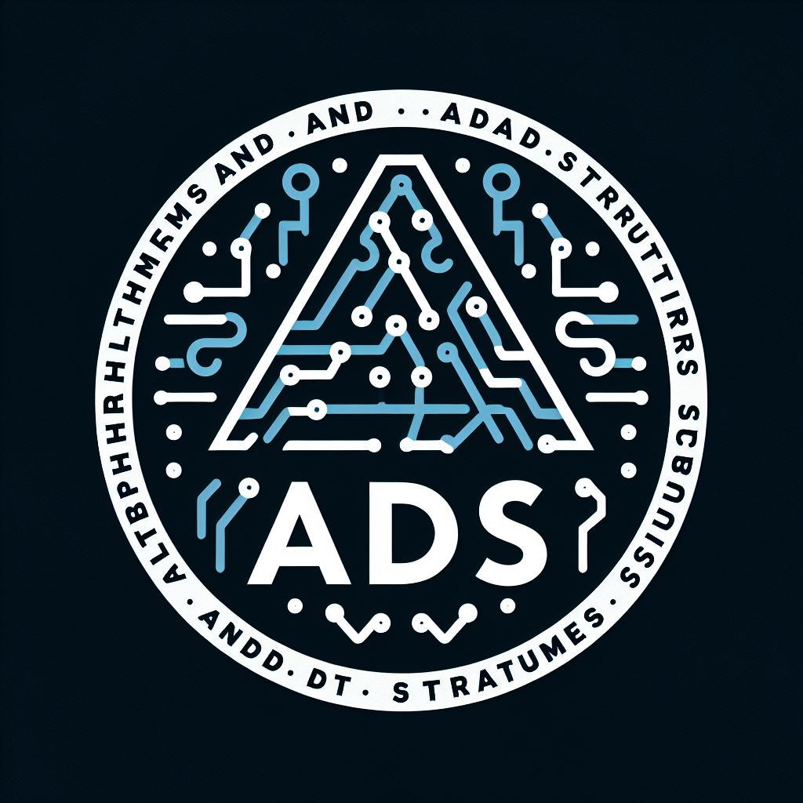

  

# Algorithm and Data Structures Lab

Welcome to my Algorithm and Data Structures Lab repository! 🚀 This repository contains solutions for Algorithm and Data Structures lab assignments that I completed during my coursework in the Computer Science program at the Bandung Institute of Technology (ITB) in 2023, while I was in my third semester. 

## 📘 Lab Description

The Algorithm and Data Structures Lab is a thrilling journey through the realm of programming and logic. Designed as a part of the Computer Science program at ITB, it aims to sharpen your programming skills and deepen your understanding of fundamental algorithmic concepts and data structures. Each lab presents exciting challenges and opportunities to apply the knowledge gained in lectures.

## 📊 Lab Score Table

| Praktikum    | Topic                                         | Score  |
|--------------|-----------------------------------------------|--------|
| 0            | Introduction to C                             | 100/100|
| 1            | ADT Sederhana                                 | 120/120|
| 2            | ADT List dengan Array Statik                  | 100/100|
| 3            | ADT List dengan Array Dinamis                 | 100/100|
| 4            | ADT Matrix                                    | 120/120|
| 5            | ADT Mesin Kata                                | 100/100|
| 6            | ADT Stack                                     | 100/100|
| 7            | ADT Queue                                     | 120/120|
| 8            | ADT Linked List                               | 100/100|
| 9            | ADT List Linier                               | 100/100|
| 10           | ADT Stack dan Queue dengan Struktur Berkait   | 100/100|
| 11           | ADT List Rekursif                             | 100/100|
| 12           | ADt Pohon Biner                               | 100/100|

Let the coding adventure begin! 🚀✨
